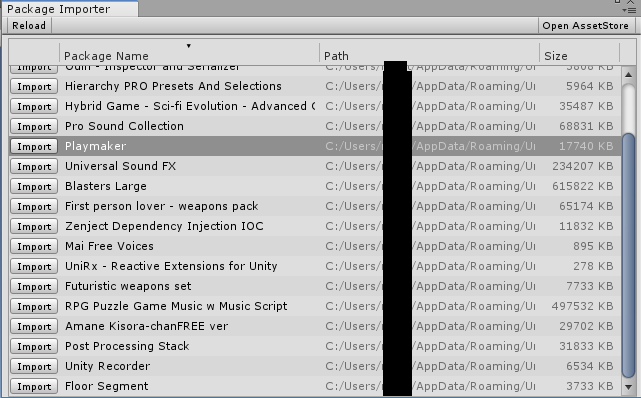
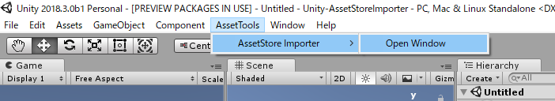
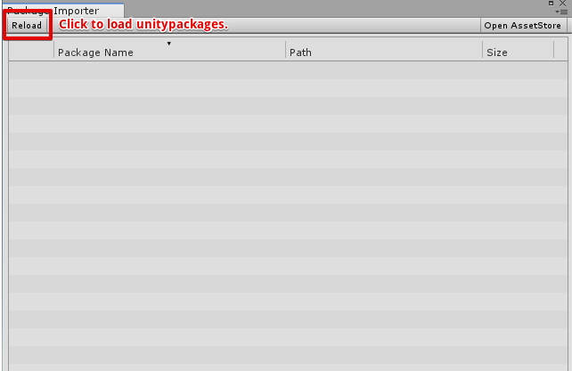
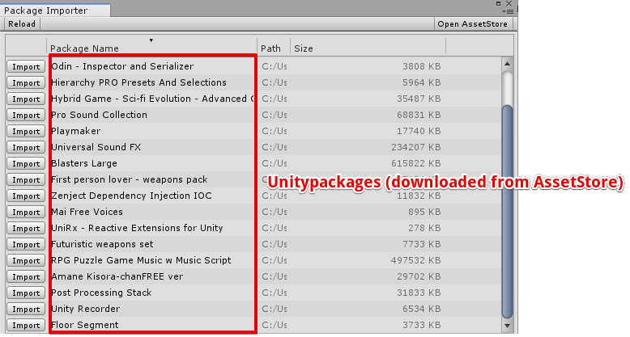
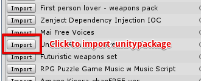

# AssetStoreImporter
## How to use
**AssetStore Importer** is tool to import Unitypackages downloaded from Unity Asset Store. 

 

## How to use
Select **"AssetTools/AssetStore Importer/Open Window"**  
 
 

Click Reload button. 
 
 

 
 

Click import button to import unitypackage. 
 
 
